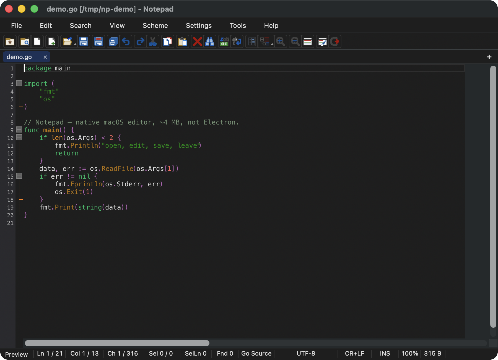

# Notepad for macOS

[](https://github.com/limin640/notepad-mac/releases)
[](https://github.com/limin640/notepad-mac/releases)
[](https://github.com/limin640/notepad-mac/releases)
[](LICENSE)

**English** | [简体中文](README.zh-CN.md) | [繁體中文](README.zh-Hant.md) | [日本語](README.ja.md) | [한국어](README.ko.md) | [Deutsch](README.de.md) | [Français](README.fr.md) | [Español](README.es.md) | [Italiano](README.it.md) | [Português](README.pt-BR.md) | [Русский](README.ru.md)

> Native Mac text editor. Port of Windows [Notepad4](https://github.com/zufuliu/notepad4). About 4 MB. Not Wine. Not Electron. Not an IDE.

**4 MB. Native. Open a file and type.**



TextEdit is too bare. VS Code drinks RAM before you hit a key. Wine-wrapped Notepad4 is about **1 GB**. This is the same editor muscle — Scintilla, 90 lexers, original colors — as a real Mac app.

| | Notepad | Wine Notepad4 | VS Code | TextEdit |
|---|---|---|---|---|
| Size | ~4 MB | ~1 GB | hundreds of MB | built-in |
| Opens | instantly | slow | slow | instantly |
| Syntax | 90 lexers, original colors | yes | yes | no |
| Native AppKit | yes | no | Electron | yes |
| Job | open, edit, save, leave | same idea, huge | IDE | notes |

The app in Dock is **Notepad**. This repo is `notepad-mac`.

## Facts

| | |
|---|---|
| App name | Notepad |
| Repo | [limin640/notepad-mac](https://github.com/limin640/notepad-mac) |
| Upstream | [zufuliu/notepad4](https://github.com/zufuliu/notepad4) (Windows) |
| Stack | Scintilla 5.6.6 + official Cocoa + AppKit |
| Platform | macOS 11+, Apple silicon (arm64). Intel: build from source |
| Signed | ad-hoc only, not notarized |
| License | Port: PolyForm Noncommercial. Upstream: BSD-3 / Scintilla / Boost |
| Agent index | [llms.txt](llms.txt) |

## Download

[**Notepad-0.1.21.dmg**](https://github.com/limin640/notepad-mac/releases/latest) → drag **Notepad** into Applications.

Not notarized. First launch from the internet: **Control-click → Open**, or `xattr -cr /Applications/Notepad.app`. Do not double-click the app inside the DMG — drag it.

## What you get

- 90 lexers, word lists and colors copied from Notepad4, not approximated
- GB18030 / GBK / BIG5 / Shift-JIS detection — Chinese Windows files do not open as mojibake
- Find / replace with regex; completion, bookmarks, folding, line ops
- Markdown / HTML / image preview
- Follows macOS light/dark and system language (11 UI languages)
- Menus, toolbar bitmaps, status bar `Ln / Col / Ch / Sel` match the Windows `Notepad4.rc`

No debugger, no Git pane, no AI sidebar.

## Build

```bash
./build.sh
open build/Notepad.app
```

Xcode (clang C++20), CMake ≥ 3.20. Default arch is arm64. DMG: `./scripts/package.sh` (do not commit the image).

```
scintilla_upstream/   Scintilla 5.6.6 (Notepad4 fork) + official Cocoa backend
lexers_def/           Original 90-language word lists and styles
macapp/               AppKit shell
tests/sci_test.mm     Core smoke tests
```

## License

See [LICENSE](LICENSE).

- **This port** (`macapp/`, scripts): [PolyForm Noncommercial 1.0.0](https://polyformproject.org/licenses/noncommercial/1.0.0) — personal use free, commercial use needs a license
- **Notepad4 lexers / icons:** BSD 3-Clause
- **Scintilla:** historical license (Neil Hodgson)
- **Boost.Regex headers:** BSL-1.0

Commercial license: <https://github.com/limin640/notepad-mac/issues>

## Donate

Help → Donate, or WeChat Pay:


